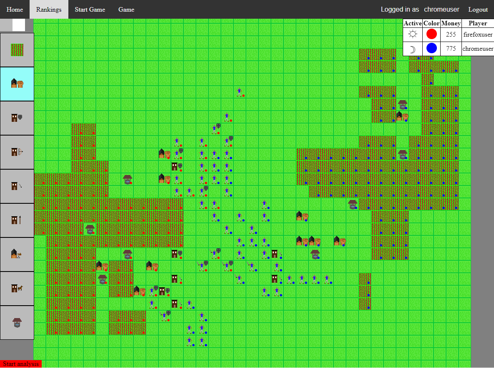

This repository contains the client and server for a multiplayer browser based game.

## Current game information

The game client is currently deployed on a static web server [here](http://script-wars-deploy.s3-website-us-west-2.amazonaws.com/). The multiplayer server is not currently deployed anywhere, but you can still start a single player game and play around with the controls.

To give an impression of what it looks like, here is a screenshot of a starting position:

### Multiplayer features

To allow for a small community to engage on multiplayer, there is a way to start games with other players based on mutual agreement, and a simple ranking system with win/loss records. The system also stores records of multiplayer games which in the future can be pursued after the game (the feature to pursue them is not implemented yet, but they are stored anyways).

## Future development plan

### Game mechanics

Details of the game mechanics are still under development, but there are a few guiding principles behind the game which together I believe are quite unique.

#### Guiding principles

* Turn based tactical warfare that requires significant experience to master
* Large scale economy based on map control and investment
* Ability to buy an huge number of new units as time goes on
* Timer system that forces turns to be a reasonable time

#### Why these principles are unique

* Age of Empires® style games have the sort of large scale economy and military that I hope to replicate, but their real time system limits the kinds of tactics that are reasonable to implement even by the best players.
* Sid Meier's Civilization® has a much more complex economy than I imagine, and less complex military tactics.

### AI based tactics

Now, the problem is that a tactical game with hundreds of units is unfortunately quite tedious, even somewhat boring. To solve this, I plan to implement a machine learning system where players can train their own tactics engines, allowing players to learn tactics once, and then move on to higher level strategies.

I believe that this could make a new and exciting game experience, where instead of grinding to leveling up with experience points, the results of the tedious process of training an AI will actually depend on how good you are at training it.

These tactics engines will also allow the game timer to be much shorter, allowing turns to last 5-10 seconds, instead a minute or two like they would have to with human players.
